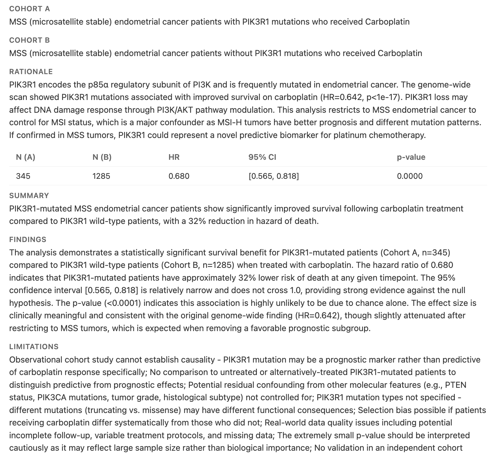

# Geryon

v much in dev/beta -- check back later hopefully.

LLM tool for exploring cancer clinicogenomics data and generating hypotheses.
Explore data,
possibly generate derived views,
propose hypotheses in a small formal language,
execute,
get effect size + pval,
interpret,
iterate.

For now, generates observations like the following:



## Agent tools

| Tool | What it does |
|------|-------------|
| `list_tables` | List available tables in the DB |
| `describe_table` | Schema + sample values for a table |
| `query_data` | Run a SELECT (max 100 rows) |
| `scan_groupby` | Scan all values of a categorical column vs outcome; returns top N hits ranked by significance with effect sizes (volcano plot data) |
| `create_derived_view` | Persist a SQL view for derived concepts (e.g. treatment sequences) |
| `submit_hypothesis` | Submit a hypothesis for statistical execution + storage |

## Setup

```bash
make dev   # uv sync --all-extras + pre-commit install
```

Data (parquet files) goes in `~/data/geryon_data/`. The workflow auto-detects
the latest subdirectory.

## Use

```bash
make run                                                # aws_bedrock, default model + settings
./scripts/run.sh --provider anthropic --model claude-sonnet-4-6
./scripts/run.sh --provider openai    --model gpt-4o
./scripts/run.sh --max-iterations 5 --num-proposals 3 --critic-cycles 1
```

Providers: `aws_bedrock` (default), `anthropic`, `openai`.
AWS Bedrock setup: [notebook](https://github.com/clinical-data-mining/llm_examples/blob/main/notebooks/04.Setting_Up_ClaudeCode_with_AWS_Bedrock.ipynb).

Sessions are written to `geryon_data/sessions/`.

```bash
make data      # manually examine raw ETL/derived data (harlequin viewer)
make viewer    # browse + human-annotate hypotheses (http://localhost:8765)
make report    # generate static HTML report from session
make label-best  # auto-label best hypotheses via LLM
```

Labels are saved to `geryon_data/labeled/`.

## ETL

```bash
make etl        # Nextflow pipeline: TSV → parquet + .profile.json per table
make etl-clean  # remove Nextflow working files
make plot       # Nextflow pipeline: generate plots from parquet data
```

## Development

```bash
make test      # unit + integration tests
make mypy
make format
make backup    # push geryon_data to its git remote
make restore   # clone geryon_data from remote
```
